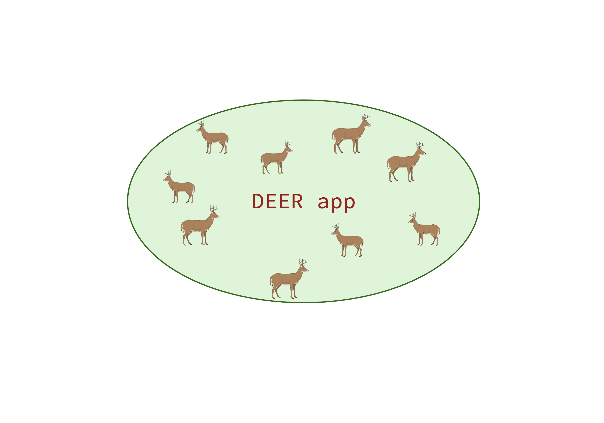

# DEER App

**Density Estimation from Encounter Rates** — A Shiny application for estimating deer density using unmarked camera trap methods.



## Overview

The DEER App provides a user-friendly interface for running three Bayesian models (uSCR, REM, and TTE) to estimate deer density from camera trap data. For **uploaded field data** that follow the current TrapTagger / park-workflow column names, completed models can be compared in the **Compare & combine** tab and combined with **WAIC-based model averaging** when multiple fits are available. On the **simulated** side, the spatial toy grid feeds **uSCR**, while separate REM/TTE teaching simulators generate model-specific count data for those tabs.

## Features

- **Three Bayesian Models:**
  - **uSCR** (Unmarked Spatial Capture–Recapture): Estimates deer density by learning from spatial detection patterns across a camera array
  - **REM** (Random Encounter Model): Converts encounter rates into density, correcting for movement speed and camera view geometry
  - **TTE** (Time-to-Event): Uses deer detection events per camera, camera-days, and viewshed geometry to estimate density

- **Data Options:**
  - Simulate camera trap data with customizable parameters (spatial SECR simulator for uSCR plus REM/TTE teaching simulators)
  - Upload deployment and images CSV files that follow the current TrapTagger / park-workflow column names

- **Model Averaging (uploaded field data):**
  - WAIC-based model averaging across whichever uploaded-data models have completed
  - Weighted and unweighted density estimates with 95% credible intervals

- **Interactive Visualizations:**
  - Camera grid plots
  - Deer distribution maps
  - Interactive leaflet maps
  - Species summary plots
  - Daily detection time series

## Installation

### Prerequisites

- R (version 4.0 or higher)
- RStudio (recommended)

### Required R Packages

The app checks required packages on startup and can install missing ones automatically. You can also install them manually:

```r
install.packages(c(
  "shiny", "bslib", "shinyjs", "DT", "ggplot2", "dplyr", "tidyr",
  "readr", "purrr", "stringr", "secr", "data.table",
  "leaflet", "ggrepel",
  "nimble", "MCMCvis", "lubridate"
))
```

**Note:** Some packages may require additional system dependencies:
- `nimble` requires a working C++ compiler/toolchain for model compilation. See the [NIMBLE installation guide](https://r-nimble.org/download.html).
- `leaflet` may require additional system libraries on some machines. If mapping packages fail to install, start with the [leaflet for R documentation](https://rstudio.github.io/leaflet/).

### Cloning from GitHub

If you use [Git](https://git-scm.com/), you can copy the project to your computer in one step:

1. Open the repository on GitHub (this project: [github.com/kcring/DEER_app](https://github.com/kcring/DEER_app)).
2. Click the green **Code** button, choose **HTTPS**, and copy the URL (it looks like `https://github.com/kcring/DEER_app.git`).
3. In a terminal, go to the folder where you want the project, then run:
   ```bash
   git clone https://github.com/kcring/DEER_app.git
   cd DEER_app
   ```
   That creates a folder named after the repository (here, `DEER_app`) with all files. To update later, run `git pull` inside that folder.

If you do not use Git, use **Code → Download ZIP** on GitHub and unzip the archive; then open the unzipped folder in RStudio.

### Running the App

1. With the project folder as your working directory (see **Cloning from GitHub** above), open `app.R` in RStudio, or from R set the working directory to the project folder.
2. Click **Run App** or run:
   ```r
   shiny::runApp()
   ```

From the command line:

```bash
Rscript -e "shiny::runApp('/path/to/DEER_app')"
```

## Usage

### Step 1: Simulate or Upload Data

**Option 1: Simulate Data**
- Navigate to the **Simulate data** tab
- Adjust simulation parameters (grid size, spacing, days, density, etc.)
- Click **Simulate grid** to generate toy data from the spatial SECR/uSCR process
- Run **USCR on simulated data** from the **USCR** tab; use **Compare & combine** for the USCR-only summary
- For REM or TTE teaching runs, use the **REM/TTE teaching simulator** lower in the same tab, then run those models from their own tabs

**Option 2: Upload field data**
- Prepare two CSV files:
  - **Deployment file**: Camera deployment information such as where and when cameras were set and recording
  - **Images file**: Detection records such as timestamps, species, counts, and Cluster IDs
- See the **Add your data** tab for required column specifications (including **`Timestamp`** on images)
- During upload, you can optionally trim each camera to the first 56 deployed days to match the current park workflow
- Upload files using the file input controls

### Step 2: Review Data Summary

- Check the **Data summary** tab to verify your data
- Review deployment summaries, species detections, and spatial distributions

### Step 3: Run Models

Navigate to the model tabs (USCR, REM, TTE):
- **Simulated data:** run **USCR** from the USCR tab, or run **REM/TTE** after generating the matching teaching simulator data
- **Uploaded field data:** run each model from its tab with the uploaded-data buttons
- Progress bars show model compilation and MCMC sampling status where applicable
- **Stop** buttons allow you to terminate long-running models
- Results appear below the buttons when complete

**Model settings:**
- Open the **Model settings** tab, then choose **Advanced** to adjust:
  - MCMC iterations, burnin, thinning
  - Number of chains
  - Prior parameters (independent priors per analysis; see **Meta-analysis** below)
  - Model-specific settings

**Meta-analysis:** The app uses independent informative priors for each dataset. Pooling across parks with hyperpriors is not implemented; combine posterior outputs externally if you run multi-study syntheses.

### Step 4: Compare & Combine Results

- **Compare & combine** tab:
  - **Simulated:** USCR density summary (single model)
  - **Uploaded field data:** results update as models finish; once multiple models are available the tab shows WAIC values and weights, model-averaged density (deer/mi²), 95% credible intervals, and probability of exceeding threshold densities
- Download **CSV** posterior summaries (parameter names, mean, 2.5% and 97.5% quantiles) from the same tab

### Shapefile workflow

- **Current:** Upload deployment and images **CSVs** only.
- **Future:** Optional study-area polygon (e.g. GeoPackage or shapefile) for clipping and state-space definition is not implemented yet.

## File Structure

```
deer_app_v2/
├── app.R                    # Main Shiny application
├── R/
│   ├── sim_and_models.R     # Model functions (USCR, REM, TTE)
│   └── data_checks.R        # Data validation and summary functions
├── www/
│   ├── deer_app_logo.png    # Main app logo
│   ├── wvu_logo.png         # WVU logo
│   ├── nps_logo.png         # NPS logo
│   └── usgs_logo.png        # Optional; add only with USGS permission (see below)
├── README.md                # This file
└── deer_app_v2.Rproj        # RStudio project file
```

## Data Format Requirements

### Deployment File Required Columns:
- **Park**: 4-character park code
- **Site Name**: Camera location identifier
- **Camera ID**: Camera identifier
- **SD Card ID**: SD card identifier
- **Start Date / End Date**: Deployment dates in `MM/DD/YYYY`
- **Start Time / End Time**: Deployment times in 24-hour format
- **Latitude / Longitude**: Decimal degrees
- **Camera Height**: Numeric camera height
- **Camera Orientation**: Cardinal direction or 0-359 degrees
- **Camera Functioning**: `Yes` or `No` (common variants like `TRUE`/`FALSE`/`1`/`0` are normalized on import)
- **Camera Malfunction Date**: Keep the column in the file; fill it when `Camera Functioning = No` for a site with images
- **Detection Distance**: Detection radius in meters
- **Notes**: Keep the column even if some rows are blank

### Images File Required Columns:
- **Site Name**: Must match deployment file
- **Latitude / Longitude**: Decimal degrees
- **Timestamp**: Detection date-time (the app expects this column name; see **Add your data** for format details)
- **Species**: Species name (deer species will be standardized)
- **Sighting Count**: Number of animals in the image; pipe-delimited values are allowed for multi-species rows
- **Image URL**: Image reference/link column used by the QC pipeline
- **Cluster ID**: Unique identifier for independent detection events

See the **Add your data** tab in the app for detailed column specifications.
Cross-year winter surveys (for example December to January) are supported; the app uses the actual deployment dates/times and image timestamps, so no separate `Survey Year` field is required.

## Model Details

### uSCR (Unmarked Spatial Capture–Recapture)
- **Pros:** Accounts for spatial detection patterns, handles camera heterogeneity
- **Cons:** Computationally intensive, requires spatial array design
- Estimates density by modeling activity centers and detection probability as a function of distance

### REM (Random Encounter Model)
- **Pros:** Fast, simple, works with single cameras
- **Cons:** Assumes random movement, requires movement speed estimates
- Converts encounter rates to density using movement speed and detection area

### TTE (Time-to-Event)
- **Pros:** Uses temporal information, accounts for detection heterogeneity
- **Cons:** Requires detection distance measurements, assumes Poisson process
- In this app, uses deer detection events per camera plus camera-days and viewshed geometry to estimate density

## Performance Notes

- **USCR** is the most computationally intensive model. For faster demos, reduce:
  - `M_uscr` (state-space size)
  - `iter_uscr` (MCMC iterations)
  - `n_chains` (number of chains)

- **REM** and **TTE** are generally faster but still benefit from reduced iterations for quick tests

- All models use parallel processing when multiple chains are specified

## Deployment and concurrent users

- **Single session:** `shiny::runApp()` is intended for one analyst at a time on a local or shared machine.
- **Concurrent users:** A production deployment (e.g. **Shiny Server**, **Posit Connect**, or **shinyapps.io**) runs one R process per app instance; multiple users share that process and can block each other during long MCMC runs. The current app includes a first background-processing prototype for uploaded-data REM runs, but USCR and TTE can still block other users during long jobs. For many simultaneous users, plan **multiple workers** or separate instances and sufficient CPU/RAM.
- **Tab UX:** The app scrolls to the top when you switch main tabs (`shinyjs`) so long pages do not leave you mid-scroll.


## Troubleshooting

**Models not running:**
- Check that all required packages are installed
- Verify data format matches requirements
- Ensure camera deployment dates are valid
- Check that detection distances are provided

**Memory issues:**
- Reduce `M_uscr` for USCR model
- Reduce number of chains
- Close other R sessions

## Citation

If you use this app in your research, please cite the underlying methods:
- uSCR: Chandler, R.B. & Royle, J.A. (2013). DOI: [10.1214/12-AOAS610](https://doi.org/10.1214/12-AOAS610)
- REM: Rowcliffe, J.M. et al. (2008). DOI: [10.1111/j.1365-2664.2008.01473.x](https://doi.org/10.1111/j.1365-2664.2008.01473.x)
- TTE: Moeller, A.K. et al. (2018). *Ecosphere* 9(6):e02331. DOI: [10.1002/ecs2.2331](https://doi.org/10.1002/ecs2.2331) ([journal page](https://esajournals.onlinelibrary.wiley.com/doi/10.1002/ecs2.2331))

## License

License to be determined.

## Acknowledgments

### Model Development
The underlying models and code were created by **Dr. Amanda Van Buskirk** under the advisement of [**Dr. Christopher Rota**](https://www.davis.wvu.edu/faculty-staff/directory/christopher-rota) within the **Davis College of Agriculture and Natural Resources at West Virginia University**.

Collaboration and feedback from **Dr. Laura C. Gigliotti** (U.S. Geological Survey, West Virginia Cooperative Fish and Wildlife Research Unit, West Virginia University) helped shape QC checks and model integration. Any **USGS logo** in the app must follow agency approval rules (see **USGS logo** above).

### Shiny App Development
This Shiny application was developed as part of the **Science in the Parks Communications Fellowship**, a collaborative effort between the **Ecological Society of America (ESA)** and the **National Park Service (NPS)**. Learn more: [https://esa.org/programs/scip/](https://esa.org/programs/scip/)

**Fellowship Support:**
- **Dr. Brian Mitchell** (NPS) - Fellowship Liaison
- **Jasjeet Dhanota** (ESA) - Mentor
- **Mary Joy Mulumba** (ESA) - Mentor

### Technical Acknowledgments
- Built with R Shiny and NIMBLE
- West Virginia University (WVU)
- National Park Service (NPS)

## Contact

**Kacie Ring**  
University of California, Santa Barbara  
Website: [kaciering.com](https://kaciering.com)  
GitHub: [@kcring](https://github.com/kcring)

---

**DEER App** — Density Estimation from Encounter Rates  
uSCR · REM · TTE — unmarked camera methods, model‑averaged to deer/mi².
