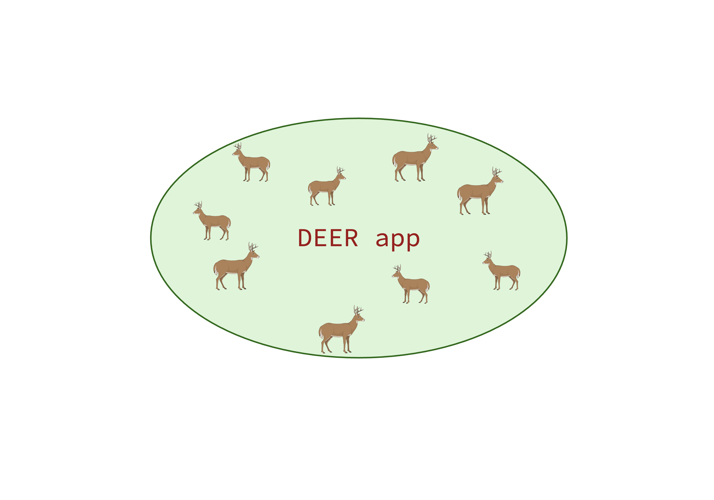

# DEER App

**Density Estimation from Encounter Rates** — A Shiny application for estimating animal density using unmarked camera trap methods.



## Overview

The DEER App provides a user-friendly interface for running three Bayesian models (`USCR`, `REM`, and `TTE`) to estimate animal density from camera trap data. For **uploaded field data** that follow the current TrapTagger / upload-workflow column names, completed models can be compared in the **Compare & combine** tab and combined with **WAIC-based model averaging** when multiple fits are available. On the **simulated** side, one **shared spatial simulator** can feed `USCR`, `REM`, and `TTE` so the simulated fits can be compared on the same dataset.

## Features

- **Three Bayesian Models:**
  - **USCR** (Unmarked Spatial Capture–Recapture): Estimates animal density by learning from spatial detection patterns across a camera array
  - **REM** (Random Encounter Model): Converts encounter rates into density, correcting for movement speed and camera view geometry
  - **TTE** (Time-to-Event): Uses animal detection events per camera, camera-days, and viewshed geometry to estimate density

- **Data Options:**
  - Simulate camera trap data with customizable parameters using one shared spatial simulator for all three models
  - Upload deployment and images CSV files that follow the current TrapTagger / upload-workflow column names
  - Design a camera array for a new site from uploaded spatial layers in the **Camera array design** tab

- **Model Averaging (uploaded field data):**
  - WAIC-based model averaging across whichever uploaded-data models have completed
  - Weighted and unweighted density estimates with 95% credible intervals

- **Interactive Visualizations:**
  - Camera grid plots
  - Simulated animal-detection maps
  - Interactive leaflet maps
  - Species summary plots
  - Daily detection time series

## Installation

### Prerequisites

- R (version 4.0 or higher)
- RStudio (recommended)

### Required R Packages

The app checks required packages on startup and can install missing ones automatically. You can also install them manually:

```r
install.packages(c(
  "shiny", "bslib", "shinyjs", "DT", "ggplot2", "dplyr", "tidyr",
  "readr", "purrr", "stringr", "secr", "data.table",
  "leaflet", "ggrepel",
  "nimble", "MCMCvis", "lubridate"
))
```

**Note:** Some packages may require additional system dependencies:
- `nimble` requires a working C++ compiler/toolchain for model compilation. See the [NIMBLE installation guide](https://r-nimble.org/download.html).
- `leaflet` may require additional system libraries on some machines. If mapping packages fail to install, start with the [leaflet for R documentation](https://rstudio.github.io/leaflet/).

### Cloning from GitHub

If you use [Git](https://git-scm.com/), you can copy the project to your computer in one step:

1. Open the repository on GitHub (this project: [github.com/kcring/DEER_app](https://github.com/kcring/DEER_app)).
2. Click the green **Code** button, choose **HTTPS**, and copy the URL (it looks like `https://github.com/kcring/DEER_app.git`).
3. In a terminal, go to the folder where you want the project, then run:
   ```bash
   git clone https://github.com/kcring/DEER_app.git
   cd DEER_app
   ```
   That creates a folder named after the repository (here, `DEER_app`) with all files. To update later, run `git pull` inside that folder.

If you do not use Git, use **Code → Download ZIP** on GitHub and unzip the archive; then open the unzipped folder in RStudio.

### Running the App

1. With the project folder as your working directory (see **Cloning from GitHub** above), open `app.R` in RStudio, or from R set the working directory to the project folder.
2. Click **Run App** or run:
   ```r
   shiny::runApp()
   ```

From the command line:

```bash
Rscript -e "shiny::runApp('/path/to/DEER_app')"
```

## Usage

### Step 1: Simulate or Upload Data

**Option 1: Simulate Data**
- Navigate to the **Simulate data** tab
- Adjust simulation parameters (grid size, spacing, days, density, etc.)
- Click **Simulate data** to generate one shared spatial simulated dataset
- Run **USCR**, **REM**, and **TTE** from their own model tabs
- Use **Compare & combine** to summarize whichever simulated model fits have finished from that shared dataset

**Option 2: Upload field data**
- Prepare two CSV files:
  - **Deployment file**: Camera deployment information such as where and when cameras were set and recording
  - **Images file**: Detection records such as timestamps, species, counts, and Cluster IDs
- See the **Add your data** tab for required column specifications (including **`Timestamp`** on images)
- During upload, you can optionally trim images at each camera to the first 56 deployed days to meet the closed-population assumption used by the models
- Upload files using the file input controls

### Step 2: Review Data Summary

- Check the **Data summary** tab to verify your data
- Review deployment summaries, species detections, and spatial distributions
- This tab summarizes **uploaded** data; simulated runs are summarized in the model tabs and **Compare & combine**

### Step 3: Run Models

Navigate to the model tabs (USCR, REM, TTE):
- **Simulated data:** run **USCR**, **REM**, and **TTE** from their tabs after generating the shared simulated dataset
- **Uploaded field data:** run each model from its tab with the uploaded-data buttons
- Run-status panels show setup, adaptive tuning, convergence checks, and final-run messages where available
- **Stop** buttons allow you to terminate long-running models
- Results appear below the buttons when complete

**Model settings:**
- Open the **Model settings** tab, then choose **Advanced** to adjust:
  - Prior parameters (independent priors per analysis; see **Meta-analysis** below)
  - Model-specific settings such as detection angle

**Meta-analysis:** The app uses independent informative priors for each dataset. Pooling across sites or studies with hyperpriors is not implemented; combine posterior outputs externally if you run multi-study syntheses.

### Step 4: Compare & Combine Results

- **Compare & combine** tab:
  - **Simulated:** results update as simulated `USCR`, `REM`, and `TTE` finish from the shared spatial simulator
  - **Uploaded field data:** results update as models finish; once multiple models are available the tab shows WAIC values and weights when WAIC is available for all completed fits, plus model-averaged density (animals/km²), 95% credible intervals, and probability of exceeding threshold densities
- Download **CSV** posterior summaries (parameter names, mean, 2.5% and 97.5% quantiles) from the same tab

### Camera array design

- Use the **Camera array design** tab to upload a boundary and optional roads, trails, buildings, parking, or exclusion layers
- The app can suggest candidate camera locations, keep a reduced well-spread subset if you enter a smaller camera count, and export camera coordinates
- For easiest uploads, zipped spatial layers are usually the smoothest option
- This design workflow is separate from the current model-fitting upload workflow, which still expects deployment and images CSVs

## File Structure

```
deer_app_v2/
├── app.R                    # Main Shiny application
├── R/
│   ├── sim_and_models.R     # Model functions (USCR, REM, TTE)
│   ├── data_checks.R        # Data validation and summary functions
│   └── camera_array_helpers.R # Camera-array design helpers
├── www/
│   ├── deer_app_logo.png    # Main app logo
│   ├── wvu_logo.png         # WVU logo
│   ├── nps_logo.png         # NPS logo
│  
├── README.md                # This file
└── deer_app_v2.Rproj        # RStudio project file
```

## Data Format Requirements

### Deployment File Required Columns:
- **Site Name**: Camera location identifier
- **Start Date / End Date**: Deployment dates in `MM/DD/YYYY`
- **Latitude / Longitude**: Decimal degrees
- **Camera Functioning**: `Yes` or `No` (common variants like `TRUE`/`FALSE`/`1`/`0` are normalized on import)
- **Camera Malfunction Date**: Keep the column in the file; fill it when `Camera Functioning = No` for a site with images
- **Detection Distance**: Detection radius in meters

Commonly used but not always required for model fitting:
- **Site**: Optional higher-level site identifier
- **Camera ID**: Camera identifier
- **SD Card ID**: SD card identifier
- **Start Time / End Time**: Deployment times in 24-hour format
- **Camera Height**: Numeric camera height
- **Camera Orientation**: Cardinal direction or 0-359 degrees
- **Camera Detection Angle**: Optional full detection angle in degrees; if omitted, the app uses the fallback angle from Model settings
- **Camera Model**: Optional descriptive metadata
- **Notes**: Keep the column even if some rows are blank

### Images File Required Columns:
- **Site Name**: Must match deployment file
- **Timestamp**: Detection date-time (the app expects this column name; see **Add your data** for format details)
- **Species**: Species name
- **Cluster ID**: Unique identifier for independent detection events
- **Sighting Count**: Number of animals in the image; pipe-delimited values are allowed for multi-species rows

Optional image columns:
- **Latitude / Longitude**: Accepted when available, but not required for model fitting if deployments provide camera coordinates
- **Image URL**: Optional recordkeeping field

See the **Add your data** tab in the app for detailed column specifications.
Cross-year winter surveys (for example December to January) are supported; the app uses the actual deployment dates/times and image timestamps, so no separate `Survey Year` field is required.

## Model Details

### USCR (Unmarked Spatial Capture–Recapture)
- Estimates density by modeling activity centers and detection probability as a function of distance

### REM (Random Encounter Model)
- Converts encounter rates to density using movement speed and detection area

### TTE (Time-to-Event)
- In this app, uses animal detection events per camera plus camera-days and viewshed geometry to estimate density

## Performance Notes

- **USCR** is the most computationally intensive model. For faster demos, use smaller datasets or smaller simulated examples for quick checks.

- **USCR** now uses adaptive tuning and may rerun the final fit if convergence checks are still poor, so it can take longer than earlier app versions

- **REM** and **TTE** are generally faster but still benefit from reduced iterations for quick tests

- The app uses a minimum of 2 chains for model runs

## Deployment and concurrent users

- **Single session:** `shiny::runApp()` is still the main local workflow.
- **Concurrent users:** support is still being improved. The uploaded-data REM path has an experimental background-worker workflow, but full multi-user server behavior still needs deployment-side testing.


## Troubleshooting

**Models not running:**
- Check that all required packages are installed
- Verify data format matches requirements
- Ensure camera deployment dates are valid
- Check that detection distances are provided

**Memory issues:**
- Use a smaller dataset or smaller simulated example for quick checks
- Close other R sessions

## Citation

If you use this app in your research, please cite the underlying methods:
- USCR: Chandler, R.B. & Royle, J.A. (2013). DOI: [10.1214/12-AOAS610](https://doi.org/10.1214/12-AOAS610)
- REM: Rowcliffe, J.M. et al. (2008). DOI: [10.1111/j.1365-2664.2008.01473.x](https://doi.org/10.1111/j.1365-2664.2008.01473.x)
- TTE: Moeller, A.K. et al. (2018). *Ecosphere* 9(6):e02331. DOI: [10.1002/ecs2.2331](https://doi.org/10.1002/ecs2.2331) ([journal page](https://esajournals.onlinelibrary.wiley.com/doi/10.1002/ecs2.2331))

## License

License to be determined.

## Acknowledgments

### Model Development
The underlying models and code were created by **Dr. Amanda Van Buskirk** under the advisement of [**Dr. Christopher Rota**](https://www.davis.wvu.edu/faculty-staff/directory/christopher-rota) within the **Davis College of Agriculture and Natural Resources at West Virginia University**.

Collaboration and feedback from **Dr. Laura C. Gigliotti** (U.S. Geological Survey, West Virginia Cooperative Fish and Wildlife Research Unit, West Virginia University) helped shape QC checks and model integration. Any **USGS logo** in the app must follow agency approval rules (see **USGS logo** above).

### Shiny App Development
This Shiny application was developed by **PhD Candidate Kacie Ring** as part of the **SciComm in the Parks fellowship**.

The **SciComm in the Parks fellowship** is a collaborative effort between the **Ecological Society of America (ESA)** and the **National Park Service (NPS)**. Learn more: [https://esa.org/programs/scip/](https://esa.org/programs/scip/)

**Fellowship Support:**
- **Dr. Brian Mitchell** (NPS) - Fellowship Liaison
- **Jasjeet Dhanota** (ESA) - Mentor
- **Mary Joy Mulumba** (ESA) - Program Assistant

### Technical Acknowledgments
- Built with R Shiny and NIMBLE
- West Virginia University (WVU)
- National Park Service (NPS)

## Contact

**Kacie Ring**  
University of California, Santa Barbara  
Website: [kaciering.com](https://kaciering.com)  
GitHub: [@kcring](https://github.com/kcring)

---

**DEER App** — Density Estimation from Encounter Rates  
USCR · REM · TTE — unmarked camera methods, model‑averaged to animals/km².
